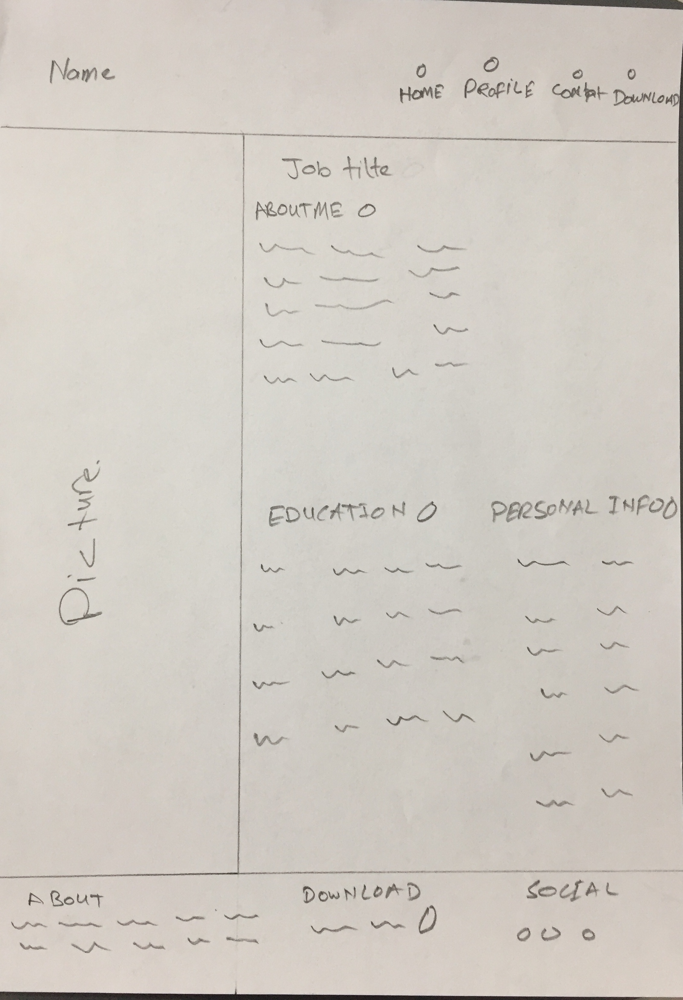
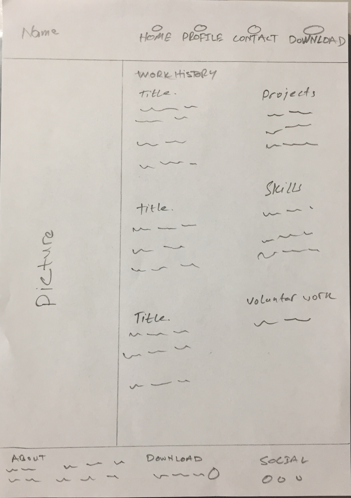
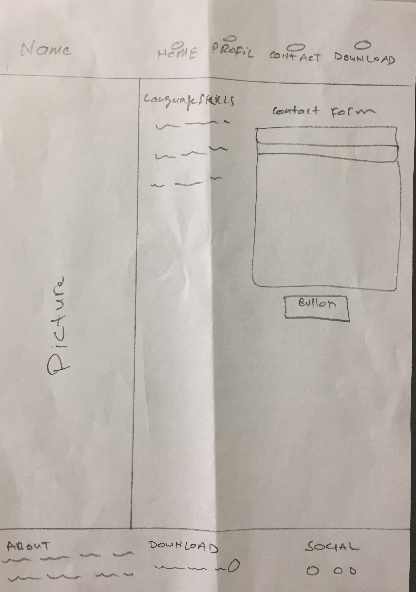

# User Centric Frontend Development Milestone Project

## Personal Portfolio Website

## Project Description

This project is created as an assignment of diploma in full stack software development. It is a responsive website and contains the personal information, education, work history, skills, CV and contact me form. I have also included some rendom websites as my project portfolio. 

## Project Goal

The goal of personal portfolio website is to create online presence with good user experience. A good showcasing of portfolio will help to connect with the employers and recruiters. Whereas, the employers and recruiters are the target audience of the website.

## Technologies Used
- HTML5
- CSS3
- Bootstrap Framework
- FontAwesome
- Google Fonts

## Wireframes

1. 
2. 
3. 

## Feature
Key features of the website are;

- Picture (My own picture)
- About me and Personal Info (A breife introduction to the employers and recruiters)
- Educational Background (Gives insight of educational background)
- Skills (The skills that I have gained during my professional career)
- Project Portfolio (Note: I have given names like Cricinfo, BBC News and Emirates just for showcasing portfolio. I have never worked on these projects in reality)
- Work History (Detailed information of the jobs and functions, whereas my work experience as a full stack software developer and company iTax is a fake)
- Contact Form (This form will allow employers and recruiters to get in touch with me and is not fully functional)
- Download (This feature will allow employers and recruiters to download my cv in pdf format)
- Social Media (Links to my social profiles where as I have not given links to my social profiles)

## Features to be added

- I want to add real projects in project portfolio section the future.
- Backend coding has to be added in the contact form so I can receive emails from receruiters and potential employers.
- Social medial profils needs to be added in future.

## Testing

The code has been validated by using;

- [W3C Markup Validation Service](https://validator.w3.org/)
- [W3C Markup Validation Service](https://jigsaw.w3.org/css-validator/)

### Result

Document checking completed. No errors or warnings to show.

I have used bootstrap framework to make website responsive. The website has been tested on different web browsers like Microsoft Edge, Google Chroome, Opera and Safari and found responsive. The website was also tested on mobiles phones like iphone 6 and Huawei P30 Lite and is responsive.

# Acknoledgements

## Content

